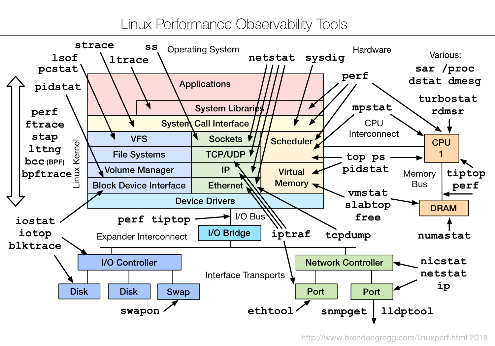

# Linux

## Shell

1. 统计日志文件，最长时间，访问次数最多的IP等 (awk)
2. 统计文件行数  `wc -l`
3. netstat, top, awk, sort, uniq, wc, grep, find, uniq, scp, vim，lsof, strace, ss等常用命令
    -  netstat -s|grep dropped 查看丢弃
    -  netstat -s | egrep "listen|LISTEN"  监控半连接

4. Linux 怎么查看Load? Load这个指标有什么含义？
    - w
    - top
    - uptime

5. 性能检测的常用命令
    - dstat
    - iostat
    - top 
    - vmstat
    - sar
    - lsof
    - perf
    - ps
    - `/proc`
    - strace

## 进程

1. 进程的状态，生命周期
2. 进行和线程的关系？什么是用户态轻量级进程? 以及进程和线程的上下文？ 
3. 信号机制，常见的信号？哪些场景用到信号？
4. 孤儿进程和僵尸进程是怎么样产生的？
5. IPC，常见的进程间通信方式？
    - Signals
    - Pipes
    - FIFOs (named pipes)
    - File Locks
    - POSIX Message Queue
    - Semaphores
    - Share Memory
    - Unix Sockets
    - Sockets
6. Linux 锁机制，需要搞清楚一些界限问题。 内核锁还是用户态的锁，锁的实现和使用是两个东西
    - 互斥锁
    - 自旋锁
    - 信号量

## 文件

1. 什么是VFS，VFS的作用？虚拟文件系统，屏蔽底层文件系统的差异，给应用层提供统一的API
2. Linux中的IO调度算法，以及在实际场景的应用？ cfq, noop, deadline, as
3. 描述下Linux对一个文件写一个字节数据的流程？描述进程找到文件描述符，然后是syscall write的到disk之间的流程
4. 系统文件系统类型有哪些？
    - ext3
    - ext4
    - xfs
    - btrfs
5. 存储性能测试工具？
    - dd
    - fio
    - iozoom

## 其他

1. Linux IO复用，以及epoll，poll，select

# tips:

1. [IPC-Overview](http://man7.org/conf/lca2013/IPC_Overview-LCA-2013-printable.pdf)